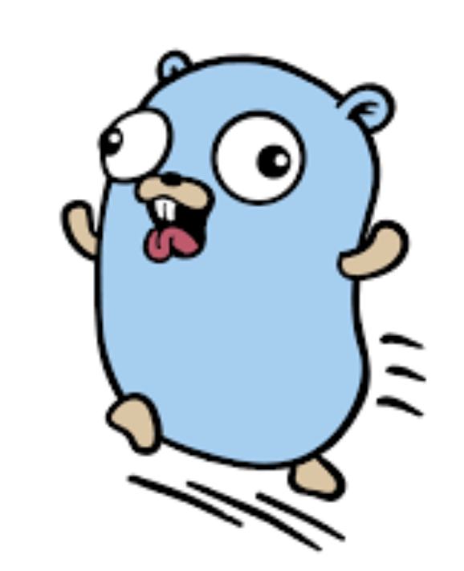
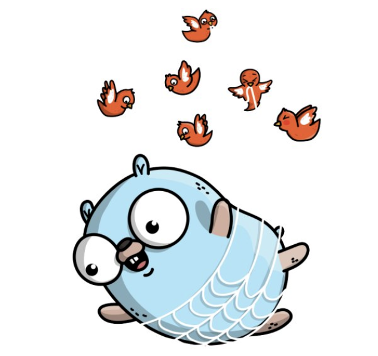

<h1>RESTful web service using gorilla mux, gorm, and postgresql with one to many relationship</h1>

This repository is an example on how to create RESTful web service using gorrila mux, gorm, and postgresql. The app consists of two models i.e. customer and email. Instead of put those two models in a single model package, this example put them directly in a service layer.

<h3>Prerequisites</h3>

1. <a href="https://golang.org">Go</a>

2. <a href="http://www.gorillatoolkit.org/pkg/mux">Gorilla Mux</a>

3. <a href="http://gorm.io">GORM</a>

4. <a href="https://www.postgresql.org">PostgreSQL</a>

<h3>Sample Payload</h4>

1. <a href="./resources/getCustomers.png">Get customers</a>

2. <a href="./resources/getCustomersByName.png">Get customer list by name</a>

3. <a href="./resources/getCustomerById.png">Get customer by</a>

4. <a href="./resources/insertCustomer.png">Insert new customer</a>

5. <a href="./resources/updateCustomer.png">Update existing customer</a>

6. <a href="./resources/deleteCustomerById.png">Delete customer by id</a>

